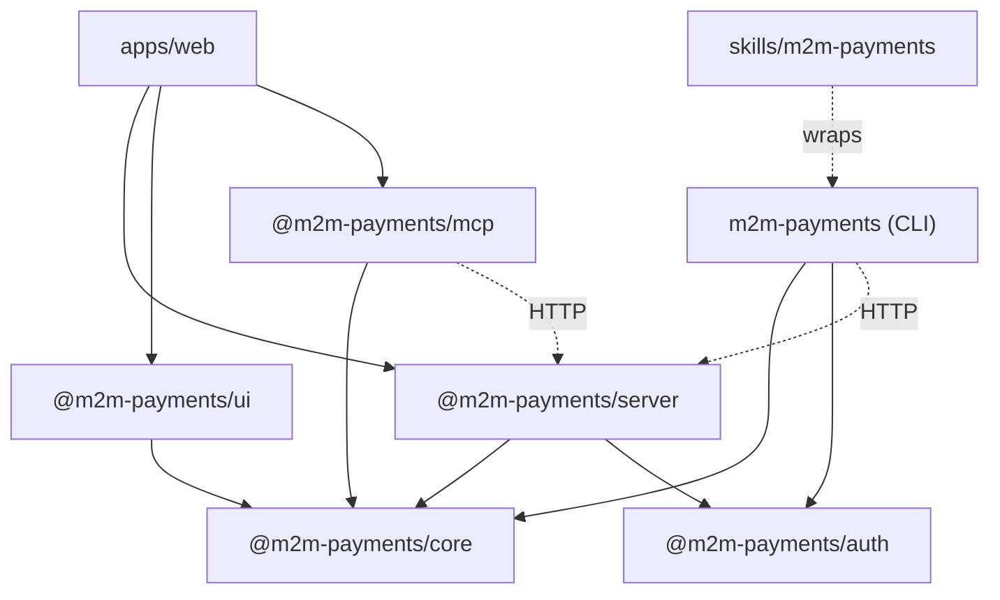
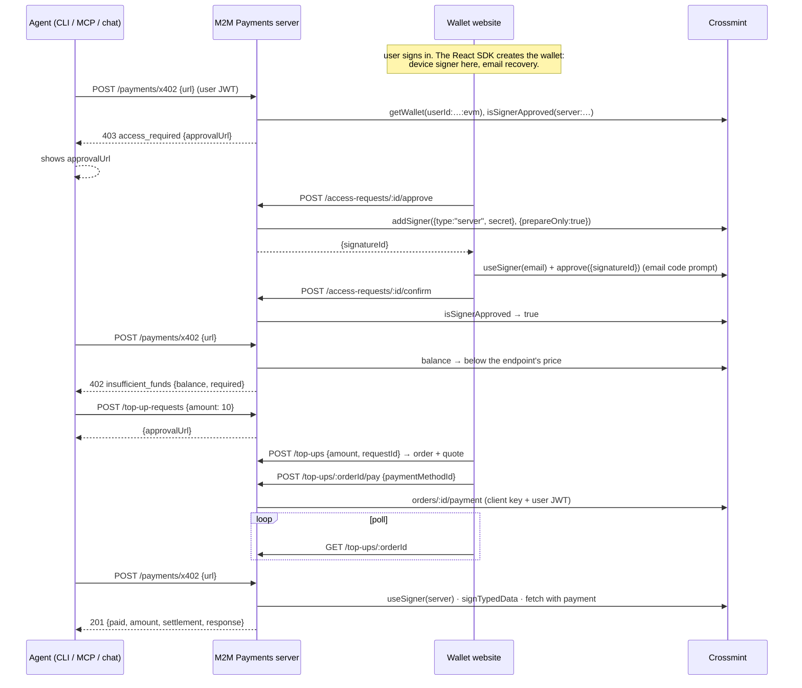

# M2M Payments architecture

M2M Payments is an open source monorepo. It shows how to give an AI agent a **non-custodial wallet it can pay other machines from**: x402 endpoints, MPP endpoints, transfers, raw transactions. The user funds the wallet by card, with no KYC, and approves the agent once. The agent then pays on its own, in the background.

It is the machine-to-machine twin of the [Agent Commerce sample app](https://github.com/Crossmint/agent-commerce-sample-app): the same site, the same five experiences, the same auth, the same package layout. Cards and checkouts are replaced by a wallet, an onramp and two payment protocols.

This document is the plan. It describes the packages, what each one contains, how they connect, and how a developer picks what to copy.

---

## 1. Mental model

Four actors:

| Actor         | Role                                                                                                            |
| ------------- | --------------------------------------------------------------------------------------------------------------- |
| **User**      | Owns the wallet. Tops it up. Approves the agent once. Uses a browser.                                           |
| **Platform**  | Your product. Hosts the M2M Payments server and the wallet website. Owns auth. Holds the agent's signer secret. |
| **Agent**     | Runs anywhere: Claude Code, ChatGPT, WhatsApp, your own chat UI. Has no browser. Pays machines.                 |
| **Crossmint** | Holds the wallet infrastructure, the onramp, the card vault. Verifies every signature.                          |

Five primitives:

| M2M Payments name | Crossmint object                    | What it is                                                                                          |
| ----------------- | ----------------------------------- | --------------------------------------------------------------------------------------------------- |
| **Wallet**        | `wallets/userId:<id>:evm`           | A smart wallet on Base. Non-custodial: a device signer in the browser, an email signer as recovery. |
| **Credits**       | USDC on Base (Sepolia on staging)   | The closed-loop token. 1 credit = 1 USD. The UI says credits, never USDC.                           |
| **Agent access**  | delegated signer `server:<address>` | The agent's server signer on the user's wallet. Approved once with an email code. Revocable.        |
| **Top-up**        | `orders/{id}`                       | Card → credits, by the onramp. No KYC.                                                              |
| **Payment**       | a transaction or a signature        | What the agent did: an x402 call, an MPP call, a transfer, a transaction.                           |

### Why no KYC

Credits are a closed-loop token: they buy machine services (inference, search, data) from the platform's agent and nothing else. Purchases of closed-loop value for digital services fall under the same merchant category as buying OpenAI or Anthropic credits, and Visa and Mastercard treat them that way. Crossmint runs the card checkout under that category, so the user is not asked for an identity document. The demo says exactly this on the landing page.

On **staging** Crossmint still wants an identity record on the user before it accepts an order. The server seeds one from a fixture (`stagingIdentityFixture`, on by default on staging, never on production) so the demo runs end to end. It is plumbing for the test environment, not part of the product, and it is documented as such.

### The one hard constraint that shapes everything

Two things can only happen in the browser, because they need the **user's** signer:

1. Creating the wallet. The device signer's key is made in the browser and never leaves it.
2. Approving a change to the wallet's signers: adding the agent's server signer, or removing it. The email code prompt runs in the browser.

Everything else runs on the server with the **server key** plus the **agent's server signer**. The agent never holds a key, a card, or a Crossmint credential: it calls the M2M Payments API as the user (OAuth, same as Agent Commerce) and the server signs with the signer the user approved.

---

## 2. Package map

```
m2m-payments-sample-app/
├── packages/
│   ├── core/        @m2m-payments/core     Types, the credits token, tool docs (browser-safe).
│   │                @m2m-payments/core/server  Crossmint wallets + orders client, x402 and MPP payers (Node).
│   ├── auth/        @m2m-payments/auth     UserAuth interface + adapters (Stytch, generic JWKS). Unchanged.
│   ├── server/      @m2m-payments/server   The HTTP API as portable route handlers. Storage interface.
│   ├── ui/          @m2m-payments/ui       React: wallet, approve agent access, top up, activity.
│   ├── mcp/         @m2m-payments/mcp      MCP server exposing the API as tools. OAuth.
│   └── cli/         m2m-payments           CLI exposing the API as commands. Ships a skill.
├── apps/
│   └── web/                                Reference website. Landing + app + API + MCP + demo paid endpoints.
├── skills/
│   └── m2m-payments/                       SKILL.md for Claude Code, OpenClaw and similar agents.
├── plugins/
│   ├── cursor/                             Cursor plugin: MCP endpoint, skill, rule.
│   └── claude/                             Claude Code plugin: MCP endpoint, skill.
└── docs/
```

Dependency direction:



Rules:

- `@m2m-payments/core` is the only package that talks to Crossmint. Its root export is browser-safe (types, the token, formatting, tool docs). `@m2m-payments/core/server` pulls in `@crossmint/wallets-sdk`, `viem`, `@x402/*` and `mppx`, and only the server imports it.
- `@m2m-payments/ui` talks to Crossmint only through the React SDK, for the two browser-only steps. All other data goes through the M2M Payments API.
- The CLI and the MCP server never hold Crossmint keys or the signer secret. They hold the user's session and talk to the API.
- The app is the example. Packages are the product.

---

## 3. Packages in detail

### 3.1 `@m2m-payments/core`

**Root export (browser-safe).**

- `CLOSED_LOOP_TOKEN` and `tokenInfo(environment)`: the credits token. Symbol `CRED`, name `Credits`, six decimals, and the underlying asset per environment: USDC on `base-sepolia` (staging) or `base` (production), with its contract address and Crossmint token locator.
- Types that every surface shares, from `docs/API.md`: `Amount`, `TokenInfo`, `WalletView`, `AgentAccess`, `AccessRequest`, `TopUpRequest`, `TopUpView`, `Payment`, `ProtocolPaymentResult`, `PaymentMethod`, `ActivityItem`, `PublicConfig`.
- `formatAmount`, `formatCredits`, `toDecimalString`, `creditsToUnits`, `unitsToCredits`.
- `TOOL_DOCS`: one source for what each tool does. The MCP server and the chat agent build their descriptions from it.
- `M2mPaymentsError`, `CrossmintApiError`.

**`/server` export (Node).**

- `createWalletsClient({ serverApiKey, environment, signerSecret })`: wraps `@crossmint/wallets-sdk`.
  - `getUserWallet(userId)`: `getWallet("userId:<id>:evm", { chain })`. Throws `WalletNotFoundError`.
  - `balance(wallet)`: the credits balance, from `wallet.balances([underlying.symbol])`.
  - `prepareAgentSigner(wallet)`: `addSigner({ type: "server", secret }, { prepareOnly: true })` → `{ locator, signatureId?, transactionId? }`.
  - `agentSignerApproved(wallet, locator)`: `isSignerApproved(locator)`.
  - `prepareRemoveAgentSigner(wallet)`.
  - `asAgent(wallet)`: `useSigner({ type: "server", secret })` and returns an `EVMWallet`, ready to sign.
  - `activity(wallet)`: `transfers({ status: "successful" })` normalized to `ActivityItem[]`.
- `CrossmintClient`: the REST calls the wallets SDK does not cover. Client key + user JWT for saved cards and for paying an order; server key for creating and reading orders and for the staging identity fixture. Adapted from Agent Commerce's client and the onramp sample app's actions.
- `payWithX402({ wallet, url, init, maxAmount })`: an `x402Client` with `ExactEvmScheme` over a signer built from `EVMWallet.signTypedData`, `wrapFetchWithPayment`, then the settlement read back from the response headers. Rejects a 402 that asks for more than `maxAmount` before signing anything.
- `payWithMpp({ wallet, url, init, maxAmount })`: `Mppx.create` with the `evm` charge method over a viem account whose `signTypedData` is the wallet's. `prepareRequest` first, so the challenge's amount can be checked against `maxAmount` before `pay()`.
- `explorerUrl(chain, kind, id)`.

**Runs on.** Server. Browser for the root export only.

### 3.2 `@m2m-payments/auth`

Unchanged from Agent Commerce: `UserAuth`, the Stytch adapter, the generic JWKS adapter, the OAuth PKCE helpers. Read that repo's architecture document for the full story. In short: normal user auth everywhere, agents log in as the user through Stytch Connected Apps, and the server forwards the user's JWT to Crossmint where a user JWT is needed.

### 3.3 `@m2m-payments/server`

The HTTP API in `docs/API.md`, as Web-standard handlers mounted in one Next.js route file. One auth plane, `Authorization: Bearer <user jwt>`.

**Which credential each route uses.**

| Routes                                                                   | Credential                              |
| ------------------------------------------------------------------------ | --------------------------------------- |
| `payment-methods`, `top-ups/:id/pay`                                     | client key + the user's JWT             |
| `wallet`, `access-requests`, `top-up-requests`, `top-ups` (create, read) | server key, wallet by `userId:<id>:evm` |
| `payments/x402`, `payments/mpp`, `transfers`, `transactions`             | server key + the agent's server signer  |

**Storage.** Stytch owns users and sessions. Crossmint owns the wallet, its signers, the orders and the on-chain history. The server stores what neither has:

| Table             | Rows                                                                                                                                     |
| ----------------- | ---------------------------------------------------------------------------------------------------------------------------------------- |
| `access_requests` | The agent's ask to use the wallet, until the user answers.                                                                               |
| `wallet_access`   | One row per user: the agent's signer locator, granted at, revoked at. The live truth is Crossmint's; this row says which signer is ours. |
| `top_up_requests` | The agent's ask for credits, until the user pays or declines. Carries the order id once paying.                                          |
| `top_up_orders`   | Order id → user id → request id, so a poll can find its request.                                                                         |
| `payments`        | The ledger: every x402 call, MPP call, transfer, transaction and completed top-up. What was asked and what settled. Never a key.         |
| `agent_sessions`  | Exchanged agent sessions, keyed by token hash. Unchanged.                                                                                |

`memoryStore()` for tests and a first `pnpm dev`; `drizzleStore(db)` from `@m2m-payments/server/drizzle` for Postgres.

**Access gate.** `requireAgentAccess(ctx, user)` loads the wallet, reads `wallet_access`, and checks `isSignerApproved` on Crossmint. When there is no active access it creates (or reuses) a pending access request and throws `403 access_required` carrying its `approvalUrl`. So an agent's very first `pay_x402` call already returns the link the user needs.

**Balance gate.** Before an x402 or MPP payment the server reads the balance. Below the endpoint's price: `402 insufficient_funds` with `balance` and `required`, so the agent asks for a top-up instead of failing on chain.

### 3.4 `@m2m-payments/ui`

React components a platform drops into its own site, and the same components the web app uses.

- `<M2mPaymentsProvider apiBaseUrl getJwt crossmintClientApiKey crossmintEnvironment userEmail>`: wires the API client to the session JWT, and mounts Crossmint's `CrossmintProvider` + `CrossmintWalletProvider` with `createOnLogin: { chain, recovery: { type: "email", email } }`, so the wallet is created on first sign-in with a device signer and email recovery. The JWT is handed to the SDK with `setJwt`.
- `useWallet()`: the API's `WalletView`, polled; plus the SDK wallet for the browser-only steps.
- `useAccessRequest(id)`, `useTopUpRequest(id)`, `usePayments()`, `useActivity()`, `usePaymentMethods()`.
- `<ApproveAgentAccess requestId variant onDone>`: the approval screen. Headline "<Agent> wants to use your wallet", what the agent will be able to do (pay x402 and MPP services, transfer credits, send transactions, all from this wallet), one reassurance line ("You approve once with a code sent to your email. Revoke it any time."), Allow and Deny. Allow calls `approve` on the API, then `wallet.useSigner({ type: "email", email })` and `wallet.approve({ signatureId | transactionId })`, which shows Crossmint's email code prompt, then `confirm`. Success replaces the screen with "Approved" and what the agent can now do.
- `<TopUp requestId? amount? onDone>`: the onramp, ported from the onramp sample app: the amount screen with the big figure and keypad, the payment method row (saved cards through `CardPicker`, "Add a new card" through Crossmint's PCI component), the order preview with the quote, Pay, and the status screen counting the credits up. Says "credits" and "no ID check" where the onramp app said USDC.
- `<WalletCard>`: balance as the big blue figure, the address, Add credits, and the agent access line with Revoke.
- `<PaymentsTable>`: the ledger, one row per payment with kind, counterparty, amount, status, hash.
- `<ConnectedAgents>`: unchanged.
- `<ApproveAgentAccessPreview>`: static, for the landing page and brand demos.

Two layers, hooks and styled components, on the same theme tokens as Agent Commerce (`src/styles.css`).

### 3.5 `@m2m-payments/mcp`

Tools, names shared with the CLI and the chat: `get_wallet`, `get_balance`, `request_wallet_access`, `get_access_request`, `request_top_up`, `get_top_up_request`, `pay_x402`, `pay_mpp`, `transfer`, `send_transaction`, `list_payments`. Titles, summaries and parameter docs come from `TOOL_DOCS` in core; the MCP surface appends how a link reaches the user. OAuth 2.1 through Stytch Connected Apps, unchanged.

### 3.6 `m2m-payments` (CLI)

```
m2m-payments login [--api https://wallet.example.com]   # OAuth PKCE; prints a URL
m2m-payments wallet                                     # address, balance, agent access
m2m-payments balance
m2m-payments access request [--reason "..."] [--wait]   # prints the approval URL
m2m-payments access status <id> [--wait]
m2m-payments top-up request --amount 10 [--reason "..."] [--wait]   # prints the top-up URL
m2m-payments top-up status <id> [--wait]
m2m-payments pay x402 <url> [--method POST] [--body '{...}'] [--header k:v] [--max 0.10]
m2m-payments pay mpp <url> [same options]
m2m-payments transfer --to 0x... --amount 5
m2m-payments tx --to 0x... [--data 0x...] [--value 0]
m2m-payments payments list
m2m-payments whoami | logout
```

Every command has `--json`. `--wait` polls until a terminal state. Exit codes: 0 ok, 1 error, 2 needs the user (an approval or top-up URL), 3 not logged in.

### 3.7 `skills/m2m-payments`

A `SKILL.md` that teaches a coding agent the order of things: `whoami`, then `wallet`; on `access_required` show the approval URL and wait; on `insufficient_funds` request a top-up and show its URL; pay with `pay x402` or `pay mpp`; never ask the user for a key or a card number; report what was paid with the hash.

### 3.8 `apps/web`

Next.js App Router. The reference deployment and the "copy me" target.

```
apps/web/app/
├── page.tsx                     the landing page
├── app/                         the app: one page, a device mockup, and an experience switcher
│                                (Mobile, Desktop, Messaging, Agent MCP, CLI skill). The wallet, the
│                                agent access, the payments ledger and the agent chat live inside it
├── login/, authenticate/        Stytch login and redirect callback, on the phone screen
├── (approve)/approve/[requestId]/  let the agent use your wallet (the link agents send)
├── (approve)/top-up/[requestId]/   add credits the agent asked for (the link agents send)
├── oauth/*, cli-callback/, install/, .well-known/*   unchanged from Agent Commerce
├── api/m2m-payments/[...path]/route.ts  the HTTP API from @m2m-payments/server
├── api/mcp/route.ts             the MCP endpoint from @m2m-payments/mcp
├── api/chat/route.ts            streamText with tools. Only file that imports the model provider
└── api/demo/x402/inference, api/demo/mpp/inference   the two paid endpoints the demo pays
```

**The chat** shows the in-process integration. Tools call the handlers in process with the user's session JWT. Two tools are client-side (no `execute`): `await_wallet_access` renders `<ApproveAgentAccess>` in the thread and `await_top_up` renders `<TopUp>`. When the user answers, the client returns the outcome as the tool result and the model continues.

**The landing** tells one story on every mock: the user asks Acme Agent for a market brief, the agent asks to use the wallet, the user approves with an email code, the wallet is short so the agent asks for a $10 top-up, the user pays by card with no ID check, the agent pays a research API over x402 at $0.05 a call and hands back the brief with the receipt.

---

## 4. Flows

### 4.1 First run: wallet, access, top-up, payment



### 4.2 Agent inside a web app (the chat)

No approval URL and no polling. `pay_x402` returns `access_required`; the model calls `request_wallet_access` then `await_wallet_access`; the chat renders `<ApproveAgentAccess>` in that slot; the user approves in place; the model retries. Same for `insufficient_funds` → `request_top_up` → `await_top_up` → `<TopUp>`.

---

## 5. Production deployment

One Vercel project, one Postgres.

| Piece             | Where                    | Notes                                                                                                                                                                                                                  |
| ----------------- | ------------------------ | ---------------------------------------------------------------------------------------------------------------------------------------------------------------------------------------------------------------------- |
| `apps/web`        | Vercel                   | Landing, `/app`, the standalone screens, `/api/m2m-payments`, `/api/mcp`, the demo endpoints.                                                                                                                          |
| Postgres          | Neon                     | Drizzle migrations for the chat tables and the six M2M Payments tables.                                                                                                                                                |
| Stytch project    | Stytch                   | Same setup as Agent Commerce: Connected Apps with a first-party CLI client and a third-party MCP client.                                                                                                               |
| Crossmint project | Crossmint console        | One client key for the browser SDK and saved cards; one server key with wallets, signatures, transactions, orders and users scopes. JWT auth: the Stytch preset or Custom tokens with the Stytch JWKS, verifier `sub`. |
| Signer secret     | Env var or KMS           | `M2M_PAYMENTS_SIGNER_SECRET`. Rotate it quarterly; every wallet approves the new signer on its next request.                                                                                                           |
| x402 facilitator  | Coinbase CDP or your own | Base Sepolia uses `https://x402.org/facilitator`; Base needs a mainnet facilitator.                                                                                                                                    |

Environment variables are all in `.env.example`.

---

## 6. Design

The look is the Agent Commerce sample app's, which is the onramp sample app's: a white ground with a dot grid, one blue accent, system sans for text and Mona Sans for money figures. The tokens live in `packages/ui/src/styles.css`; the frames in `apps/web/components/frame/`. The approval screen follows the same fixed order as the card one: headline, what is asked, one reassurance line with a lock, Allow, Deny. The top-up screens are the onramp app's screens: the amount with a keypad, the order preview, the count-up on success.

---

## 7. Decisions

1. **Name for the token**: credits, symbol `CRED`. Never USDC in user-facing text. The underlying asset is in `TokenInfo.underlying` for developer surfaces.
2. **Wallet creation**: in the browser, by the React SDK on first sign-in. The server resolves it by owner locator and never stores an address.
3. **Agent identity**: one server signer per deployment, from one secret. The `wallet_access` row records which signer is ours. Crossmint is the truth about whether it is approved.
4. **Payments run server side.** The agent never touches a key. The server checks balance and `maxAmount` before it signs.
5. **Two client-side tools in the chat** (`await_wallet_access`, `await_top_up`), the same pattern Agent Commerce used for `await_agent_card_approval`.
6. **Staging identity fixture**: on by default on staging, off on production, named for what it is.
7. **Demo paid endpoints** live in the app so the demo needs no third-party API key.
